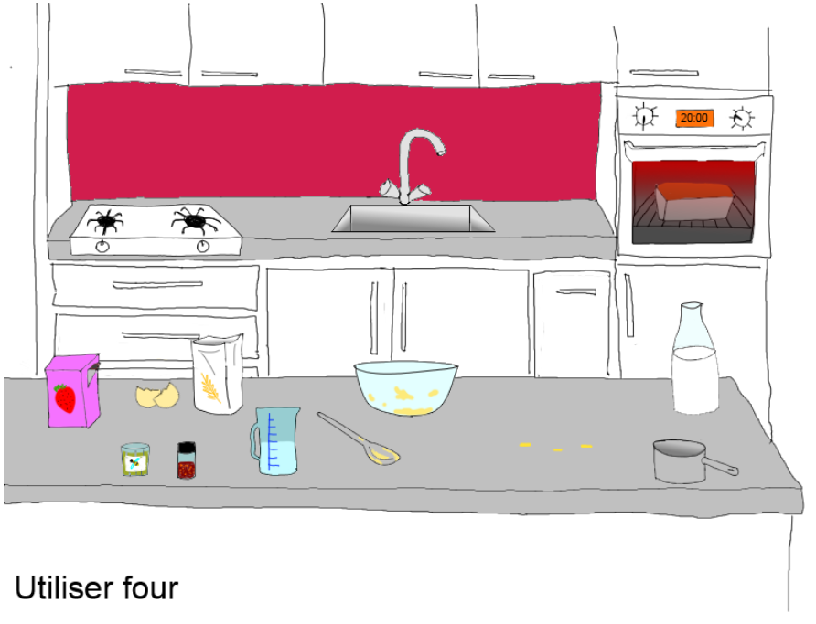

# MasterChef
Projet MasterChef pour les Master GAME

*Les développements parallèles de ce projet sont visibles dans les autres branches*

## branche : accompagnement
Dans cette branche, la création d'un arbre d'objectifs, basés sur les interactions disponibles, rend possible pour un algorithme de connaître et d'indiquer au joueur les interactions suivantes à effectuer pour progresser dans le scénario, vers l'objectif général qui est l'atteinte d'un état final défini.
Un personnage virtuel (le chef) est utilisé pour donner les indications au fil du déroulement du scénario.

